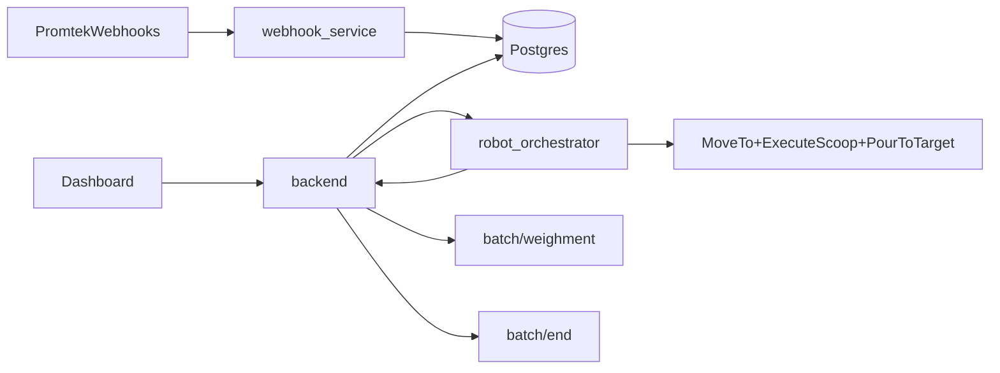

# BT/Webhook Integration Plan

## Recommended Architecture

Use the backend as the integration hub.

- `webhook_service` remains the ingestion edge for `BatchReleasedEvent` and `StockItemLocationAllocatedEvent`.
- `backend` remains the system of record for:
  - webhook weightment rows
  - stock-location rows
  - operator actions from the dashboard
  - robot run state
  - downstream `/batch/weighment` and `/batch/end` calls
- `dashboard` should only trigger backend actions and display state. It should not translate webhook rows into robot commands.
- `robot_orchestrator` should stay focused on robot execution, using a tree purpose-built for one weightment run at a time.

## Why This Is The Best Fit

The current codebase already separates responsibilities this way.

- The webhook side already persists batch-release and stock-location events in the database.
  - [src/backend/webhook_service/main.py](/home/ashwanth/ws_rhapsodi-promtek-dev/src/backend/webhook_service/main.py)
- The backend already serves dashboard pages and owns the send/completion logic.
  - [src/backend/app/main.py](/home/ashwanth/ws_rhapsodi-promtek-dev/src/backend/app/main.py)
- The dashboard already behaves like an operator view over backend data.
  - [src/dashboard/src/pages/WebhookWeightmentsPage.tsx](/home/ashwanth/ws_rhapsodi-promtek-dev/src/dashboard/src/pages/WebhookWeightmentsPage.tsx)
  - [src/dashboard/src/pages/WebhookWeightmentDetailPage.tsx](/home/ashwanth/ws_rhapsodi-promtek-dev/src/dashboard/src/pages/WebhookWeightmentDetailPage.tsx)
- The BT/orchestrator already expects robot-ready task inputs, not raw webhook payloads.
  - [src/robot_orchestrator/bt_trees/README.md](/home/ashwanth/ws_rhapsodi-promtek-dev/src/robot_orchestrator/bt_trees/README.md)
  - [src/robot_orchestrator/bt_trees/scoop_weigh_pour.xml](/home/ashwanth/ws_rhapsodi-promtek-dev/src/robot_orchestrator/bt_trees/scoop_weigh_pour.xml)

## Recommended Execution Model

Drive the robot one weightment row at a time.

This fits the current DB shape best:

- one `webhook_weightments` row
- one robot execution request
- one BT run
- one completion update
- one downstream `/batch/weighment` post

This is simpler and safer than trying to pass an entire MES batch directly into the BT on the first integration.

## Proposed New BT Flow

Create a new XML tree for webhook-driven execution instead of forcing `main.xml` to absorb backend/webhook concerns.

Suggested new tree purpose:

- consume one translated weightment task from the backend adapter
- move to mapped scoop location
- execute scoop
- move to weigh location
- pour to target
- return success/failure plus measured result

Best base to reuse:

- [src/robot_orchestrator/bt_trees/scoop_weigh_pour.xml](/home/ashwanth/ws_rhapsodi-promtek-dev/src/robot_orchestrator/bt_trees/scoop_weigh_pour.xml)

Why this tree is the better starting point than `main.xml`:

- it already matches your scoop -> weigh -> pour strategy
- it avoids QR-specific assumptions from `main.xml`
- it is closer to your current manual scooping startup flow in [src/robot_orchestrator/bt_trees/startupOrchestrator.md](/home/ashwanth/ws_rhapsodi-promtek-dev/src/robot_orchestrator/bt_trees/startupOrchestrator.md)

## Backend Adapter Layer

Add a backend orchestration adapter endpoint, for example:

- `POST /webhook_weightments/{id}/run_robot`

That endpoint should:

- load the weightment row
- resolve stock location by `ingredient_id`
- map `location_id` or `location_code` to robot target names
- convert `target_weight_kg` to the robot/BT unit contract
- call the orchestrator start service or action
- create a robot-run record/status for the dashboard

Keep the existing `Send` flow as a temporary manual fallback until the robot callback path is complete.

## Mapping Layer Needed

The main integration seam is a translation from business data to robot data.

Recommended mapping contract:

- `ingredient_id` + `site_id` -> latest stock location row
- `location_id` or `location_code` -> robot `container_name`
- `container_name` -> robot waypoints/targets
- `target_weight_kg` -> BT target weight in grams if the tree stays in grams

Store this mapping in backend-owned config rather than hardcoding it in the dashboard or XML.

Likely files/modules to add:

- [src/backend/app/main.py](/home/ashwanth/ws_rhapsodi-promtek-dev/src/backend/app/main.py) for endpoints initially
- new backend helper module under `src/backend/app/` for orchestration/mapping logic

## Robot Completion Path

Do not mark a weightment completed just because the operator clicked a button.

Instead:

- dashboard starts robot run through backend
- backend starts orchestrator
- orchestrator or a ROS bridge reports completion result back to backend
- backend updates:
  - `actual_weight_kg`
  - `start_utc`
  - `end_utc`
  - `energy_kwh`
  - success/failure state
- backend then sends downstream `/batch/weighment`
- when all rows in the batch are complete, backend sends `/batch/end`

This preserves one source of truth and prevents the dashboard from becoming a process controller.

## Short-Term Implementation Sequence

1. Define the backend-to-robot contract.
  - Input: weightment row + resolved location + target weight
  - Output: completion payload with actual weight and timestamps
2. Create a new XML tree for webhook-driven scoop/weigh/pour execution.
  - Base it on [src/robot_orchestrator/bt_trees/scoop_weigh_pour.xml](/home/ashwanth/ws_rhapsodi-promtek-dev/src/robot_orchestrator/bt_trees/scoop_weigh_pour.xml)
3. Add backend mapping logic from stock-location rows to robot targets.
4. Add backend endpoint to launch one robot run for one weightment row.
5. Add robot completion callback path into backend.
6. Change dashboard action from `Send` to `Run Robot` or split into:
  - `Run Robot`
  - `Send To MES` for fallback/debug only
7. Move final downstream `/batch/weighment` and `/batch/end` triggering fully behind robot-completion success.

## Key Design Decisions

Recommended defaults:

- one weightment row per robot run
- backend owns orchestration decisions
- dashboard is operator UI only
- use stock-location rows as the source of physical pickup location
- create a new BT XML instead of overloading `main.xml`
- keep unit conversion explicit at the backend/orchestrator boundary

## Files To Touch First

- [src/backend/app/main.py](/home/ashwanth/ws_rhapsodi-promtek-dev/src/backend/app/main.py)
- [src/backend/app/models.py](/home/ashwanth/ws_rhapsodi-promtek-dev/src/backend/app/models.py)
- [src/dashboard/src/pages/WebhookWeightmentDetailPage.tsx](/home/ashwanth/ws_rhapsodi-promtek-dev/src/dashboard/src/pages/WebhookWeightmentDetailPage.tsx)
- [src/robot_orchestrator/bt_trees/scoop_weigh_pour.xml](/home/ashwanth/ws_rhapsodi-promtek-dev/src/robot_orchestrator/bt_trees/scoop_weigh_pour.xml)
- [src/robot_orchestrator/bt_trees/README.md](/home/ashwanth/ws_rhapsodi-promtek-dev/src/robot_orchestrator/bt_trees/README.md)
- [src/robot_orchestrator/bt_trees/startupOrchestrator.md](/home/ashwanth/ws_rhapsodi-promtek-dev/src/robot_orchestrator/bt_trees/startupOrchestrator.md)

