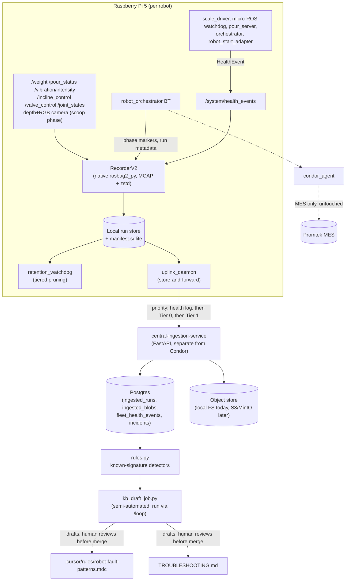

# Data Architecture

Canonical reference for how this repo collects, stores, uploads, and
learns from robot data. Supersedes the scattered per-subsystem notes
that used to be the only source of truth for this (in particular
[`src/backend/webhook-run-observability.md`](../src/backend/webhook-run-observability.md),
which is now generalized by [`TROUBLESHOOTING.md`](../TROUBLESHOOTING.md)).
Read this first if you're new to the data pipeline; go to the linked
source files for implementation detail.

## Why this exists

Every Raspberry Pi 5 running Rhapsodi OS produces three kinds of data
that all matter for different reasons:

1. **Historical/fault-finding data** - so a human or a Cursor agent can
   answer "why did this run fail" and "has this Pi been flaky" without
   SSH-ing in and grepping `docker logs`.
2. **Future ML training data** - pour-phase control-loop signal
   (vibration/incline/valve/weight) and scoop-phase depth+RGB vision,
   captured now even though model training hasn't started, so the
   corpus exists when it's needed.
3. **Business/MES data** - stays entirely on the existing
   `condor_agent` path (`/batch/weighment`, `/batch/end`,
   `/timeseries`). **Nothing described in this document touches
   Condor** - it's a deliberately separate channel (see
   [`README-condor-agent-pi.md`](../README-condor-agent-pi.md)).

The design constraints that shaped every decision below: each Pi has
small local storage (\<=128GB) and intermittent connectivity, so the
edge is the source of truth for raw data and only small
processed/health data syncs continuously - raw MCAP/vision is pulled
centrally in batches, resumable, and never deleted locally until
acknowledged.

## Architecture



## Per-run local layout

Every run — lights-out training episode or webhook weightment — lands
under a **single** `DATA_OUTPUT_ROOT` (default `/data/runs`), with a
per-mode subdirectory. Profiles no longer point at separate
`/data/webhook` vs `/data/lightsout` roots; mode is the first path
segment under the shared root (see [MODES.md](MODES.md)):

```
{output_root}/                 # DATA_OUTPUT_ROOT, default /data/runs
  manifest.sqlite              # local run index + outbox state (see below)
  health.jsonl                 # fleet-wide (device-scoped) health events
  {mode}/                      # e.g. lightsout | webhook | mes-condor | unknown
    {run_folder}/              # run_key = this folder's name
      metadata.json            # Tier 0 - schema_version, mode, environment, phase timestamps
      events.jsonl             # Tier 0 - health events scoped to this run
      episode_{N}/  (or webhook_run/)   # Tier 1 - bag_path: rosbag2 MCAP chunks + metadata.yaml
      *.parquet                # Tier 0 - written by the `processing` service once it responds
```

`run_key` is just `{run_folder}`'s basename - it's what ties together
the manifest row, the uplink protocol's URL path segment, and the
`ingested_runs`/`incidents` rows on the server side. Manifest and
health log stay at the root; only run folders nest under `{mode}/`.

## Data formats

| Artifact | Format | Why |
|---|---|---|
| `run.mcap` (a directory of chunks) | MCAP, zstd-compressed | Self-describing, plays directly in Foxglove/`ros2 bag play`, what Roboto AI ingests natively. Written by [`RecorderV2`](../src/data_collection_manager/data_collection_manager/recorder_v2.py) via native `rosbag2_py`, not a `ros2 bag record` subprocess. |
| `metadata.json` | JSON | Human-readable, carries an explicit `schema_version` so the format can evolve without breaking readers of older runs. |
| `events.jsonl` / `health.jsonl` | JSON Lines | Append-only, greppable with `cat`/`jq` on a bare Pi with zero tooling; streams off `/system/health_events` without buffering a whole file in memory. |
| `features.parquet` | Apache Parquet | Columnar, native to pandas/polars/pyarrow, and the same tabular format LeRobot itself uses - a future ML export becomes a re-chunking step, not a rewrite. |
| `manifest.sqlite` | SQLite | Transactional, durable across power loss, queryable with no server process. |
| `device.yaml`, `recording_profiles.yaml`, `robots.yaml` telemetry blocks | YAML | Matches this repo's existing config convention. |
| `HealthEvent` | `.msg` in `robot_common_msgs` | Same declaration style as every other typed topic in this repo. |
| Central structured indices (`ingested_runs`, `ingested_blobs`, `fleet_health_events`, `incidents`) | Postgres, via SQLAlchemy | Extends the same database `src/backend/app` already uses, rather than introducing a new database technology. |
| Central bulk artifacts (MCAP chunks, future vision MP4/PNG, Parquet) | Object store | `LocalFilesystemObjectStore` today ([`ingestion/object_store.py`](../src/backend/ingestion/ingestion/object_store.py)); the interface is deliberately narrow so an S3/MinIO-backed implementation is a drop-in swap later. |
| Knowledge-base outputs | `.mdc` (Cursor rule) + Markdown | See [Self-updating knowledge base](#8-self-updating-knowledge-base) below. |

**Deferred, not built in this phase:**
- Extracting the scoop-phase vision stream out of the MCAP into a
  `vision/` folder (`H.264` MP4 for RGB, 16-bit PNG sequence for depth,
  `camera_info.json`) as its own independently-pruneable/uploadable
  Tier-1 artifact. Raw scoop-phase frames are captured into `run.mcap`
  today (see `scoop` profile in `recording_profiles.yaml`); the
  extraction post-process is future work.
- **LeRobot v3 export** (chunked Parquet/MP4/JSON under
  `data/`/`videos/`/`meta/`) - a future batch tool reads many runs and
  repackages them; not needed until model training actually starts.
- Cross-robot-type schema normalization - each robot type
  (niryo/jaka/...) declares its own `telemetry:` contract in
  `robots.yaml` today; unifying them is a mechanical mapping-layer
  exercise deferred until a second robot type actually needs it.
- Migrating the central object store from local filesystem to
  S3/MinIO - the `ObjectStore` interface exists specifically so this is
  a swap, not a rewrite.

## 1. Device identity

[`config/device.yaml`](../config/device.yaml.example) is the single
source of truth for a Pi's `device_id`, `robot_id`, `site_id`,
`robot_type`, and fleet URLs (`ingestion_url`, etc.) - loaded by
[`rhapsodi_common.device_config`](../src/rhapsodi_common/rhapsodi_common/device_config.py)
(Python) and
[`rhapsodi_common_cpp`](../src/rhapsodi_common_cpp/src/device_config.cpp)
(C++), with a hardcoded fallback (`robot-1`, `http://localhost:8011`)
if the file is missing so a broken config degrades gracefully instead
of crashing every node on the Pi. This replaced scattered
`robot_id="robot-1"` / `localhost` defaults across
`manager_node.py`, `robots.yaml`, and docker env files.

`src/scooping_controller/config/robots.yaml` carries a `telemetry:`
block per robot type declaring its canonical proprioception/action/
vision topic names and types - a declared contract so a future
cross-robot unification pass only has to write a mapping layer, not
rediscover topics per robot.

## 2. Health-event bus

[`robot_common_msgs/msg/HealthEvent`](../src/robot_common_msgs/msg/HealthEvent.msg)
(`{stamp, device_id, component, severity, code, message,
context_json}`) on `/system/health_events` is the structured
replacement for "logs a line into `docker logs` and nothing else ever
sees it again." Publishers today:

| Component | Example codes |
|---|---|
| `pour_server.cpp` | `pour_overshoot`, `pour_no_progress_timeout`, `pour_stale_weight_abort`, `pour_stale_weight_during_settle`, `pour_max_time_timeout` |
| `weighing_scale_node.cpp` | `scale_readings_stale`, `scale_readings_resumed` |
| `rhapsodi_common.microros_watchdog` | `microros_heartbeat_stale`, `microros_heartbeat_recovered` |
| `robot_orchestrator` (`orchestrator_main.cpp`) | `bt_tree_failure` |
| `robot_adapter/main.py` | `robot_start_service_unavailable`, `robot_start_service_call_timeout`, `robot_start_service_empty_response`, `robot_start_rejected` |
| `data_collection_manager` (recorder/uplink/retention) | `recorder_start_failed`, `recorder_stop_failed`, `uplink_fleet_log_sync_failed`, `uplink_tier0_sync_failed`, `uplink_tier1_upload_failed`, `retention_tier1_backlog_high` |

[`rhapsodi_common.health_log.HealthEventLogger`](../src/rhapsodi_common/rhapsodi_common/health_log.py)
subscribes to this bus and writes every event to both a rolling
fleet-wide `health.jsonl` (device-scoped: "has this Pi been flaky") and
the active run's `events.jsonl` (run-scoped: "why did this run fail"),
via `data_collection_manager`'s `manager_node.py`. A logging failure
here never takes the host node down - errors are logged, not raised.

## 3. RecorderV2 - phase-aware native writer

[`recorder_v2.py`](../src/data_collection_manager/data_collection_manager/recorder_v2.py)
replaced the old `subprocess.Popen(['ros2', 'bag', 'record', ...])`
approach with the native `rosbag2_py` writer API (MCAP storage plugin,
zstd chunk compression): real error surfacing (a CRITICAL HealthEvent
on start failure instead of a silently-orphaned process), and a safe
flush/close on `SIGTERM` instead of relying on the subprocess to catch
its own signal.

[`recording_profiles.yaml`](../config/recording_profiles.yaml) declares
which topics belong to which phase (`always_on`, `pour`, `scoop`,
`transport`), loaded by
[`recording_profiles.py`](../src/data_collection_manager/data_collection_manager/recording_profiles.py).
`RecorderV2` does not do live per-phase topic gating - every declared
topic records for the run's full duration; phase-scoping happens
downstream, by timestamp, using the phase markers
`robot_orchestrator`'s `PhaseMarkerNode` already publishes
(`scoop_start`/`scoop_end`, `pour_start`/`pour_end`, etc. - see
`src/robot_orchestrator/bt_trees/scoop_weigh_pour.xml`). A missing or
malformed `recording_profiles.yaml` falls back to the historical
hardcoded topic list rather than taking recording down.

The recorder runs as its own supervised unit, independent of
`robot_orchestrator` - an orchestrator crash mid-run doesn't orphan a
recording process, and a recorder issue doesn't take the BT down.

## 4. Local manifest + tiered retention

[`manifest.py`](../src/data_collection_manager/data_collection_manager/manifest.py)
defines `manifest.sqlite`'s schema: a `runs` table (identity + sync/ack
timestamps + anomaly flag) and an `artifacts` table (path + tier per
run), in WAL mode for safe concurrent access from the recorder
(writer), `retention_watchdog` (reader/pruner), and `uplink_daemon`
(reader/updater) as separate processes.

- **Tier 0** (`metadata.json`, `features.parquet`, `events.jsonl`):
  small, always kept, synced first. Never pruned.
- **Tier 1** (`run.mcap` bag directory, future `vision/`): bulky,
  pruned only once `uplink_daemon` has recorded `tier1_acked_at` for
  that run, oldest-first, with anomaly-flagged runs exempt.

[`retention_watchdog.py`](../src/data_collection_manager/data_collection_manager/retention_watchdog.py)
runs `run_retention_pass` on a timer: prunes every eligible Tier-1
run, then publishes a WARN `retention_tier1_backlog_high` HealthEvent
if unacknowledged Tier-1 data crosses a configurable size threshold, so
an unattended Pi filling up its SD card is visible fleet-wide instead
of silently failing the next recording. If `uplink_daemon` is down or
behind, this is a safe no-op for deletion by construction - nothing
gets `tier1_acked_at` until the server actually acks it.

## 5. Store-and-forward uplink

[`uplink_client.py`](../src/data_collection_manager/data_collection_manager/uplink_client.py)
implements the wire protocol against `central-ingestion-service`:

| Call | Endpoint | Behavior |
|---|---|---|
| `append_fleet_log` | `POST /v1/fleet/{device_id}/health` | Tails `health.jsonl` incrementally by byte offset - no checksum needed, a resent already-seen line is harmless. |
| `sync_tier0` | `POST /v1/runs/{run_key}/tier0` | One multipart POST per run for `metadata.json`/`events.jsonl`/`features.parquet` - small enough for whole-file-at-once. |
| `upload_blob` | `GET .../tier1/{blob}/status`, `PUT .../tier1/{blob}`, `POST .../tier1/{blob}/finalize` | Each file inside a Tier-1 artifact uploads as its own blob with server-reported byte-offset resume and a server-side sha256 check on finalize. |
| `complete_tier1` | `POST /v1/runs/{run_key}/tier1/complete` | Marks the run fully ingested once every blob is finalized. |

[`uplink_daemon.py`](../src/data_collection_manager/data_collection_manager/uplink_daemon.py)'s
`run_uplink_pass` drives this against `manifest.sqlite` in the
required priority order - fleet health log, then Tier 0, then Tier 1 -
and only calls `mark_tier0_synced`/`mark_tier1_acked` once the server
has actually acknowledged the data (that ack is what unblocks
`retention_watchdog`'s pruning). One run's upload failure is reported
as a HealthEvent and skipped, never blocking the rest of the pass -
everything is safe to retry next tick since the server, not local
state, is the source of truth for how much of a blob has arrived.

Runs as its own supervised unit, independent of the recorder and
`retention_watchdog`.

## 6. central-ingestion-service

[`src/backend/ingestion/`](../src/backend/ingestion/) is the receiving
side of the uplink protocol above - a FastAPI app **fully separate**
from `src/backend/app` (`condor_agent`/MES). It replaced the old
orphaned `/ingest` endpoint, which assumed filesystem access to a
`run_folder` on the same disk as the Pi (unworkable for a real fleet).

- `ingestion/models.py`: its own SQLAlchemy `Base`/tables
  (`IngestedRun`, `IngestedBlob`, `FleetHealthEvent`, `Incident`)
  against the **same Postgres instance** `src/backend/app` already
  uses - extending the existing database rather than introducing a new
  one, while staying an independently deployable service.
- `ingestion/object_store.py`: `LocalFilesystemObjectStore` behind a
  small `ObjectStore` interface (`part_size`/`append_part`/
  `finalize_part`/`delete_part`/`write`/`read`) - a future S3/MinIO
  implementation is a swap, not a rewrite.
- Runs as the `ingestion` docker-compose service, port `8011`
  (matching `device.yaml`'s `ingestion_url` default).

## 7. Incident detection

[`ingestion/rules.py`](../src/backend/ingestion/ingestion/rules.py) is
a small, dependency-free rules engine: a registry of detector functions
run over every incoming health-event-shaped record (both fleet
`health.jsonl` lines and per-run `events.jsonl` lines synced via
Tier 0), producing `IncidentCandidate`s that `ingestion/main.py`
persists to the `incidents` table (de-duplicated against any still-open
incident of the same signature/device/run within a 5-minute window).

Known signatures encoded today:

| Signature | Detected from |
|---|---|
| `dds_transport_timeout` | `robot_start_service_call_timeout` code - the "Fast DDS transport/runtime problem" `504` postmortem. |
| `pour_overshoot` / `pour_overshoot_severe` | `pour_overshoot` code, severity escalated using the overshoot amount derived from the event's own `target_weight`/`final_net_g` context. |
| `pour_stalled_abort` | `pour_no_progress_timeout` / `pour_stale_weight_abort` / `pour_stale_weight_during_settle` codes. |
| `microros_heartbeat_stale` | `microros_heartbeat_stale` code. |
| `scale_readings_stale` | `scale_readings_stale` code. |
| `sqlalchemy_detached_instance_error` | Free-text match on `DetachedInstanceError` in the message - nothing publishes this backend-side symptom as a structured code yet. |
| `postgres_idle_in_transaction` | Free-text match on `idle in transaction` - same reasoning. |

## 8. Self-updating knowledge base

[`ingestion/kb_signatures.py`](../src/backend/ingestion/ingestion/kb_signatures.py)
holds the curated prose (symptom/root cause/fix/"if this recurs")
per signature - separate from `rules.py` so "how do we detect this"
and "what does it mean" evolve independently.

[`ingestion/kb_draft_job.py`](../src/backend/ingestion/ingestion/kb_draft_job.py)
reads every incident and **drafts** (never commits/pushes - that's a
human/reviewing-agent step) two files:

- [`.cursor/rules/robot-fault-patterns.mdc`](../.cursor/rules/robot-fault-patterns.mdc) -
  glob-attached to every subsystem that can emit these signatures, so a
  future Cursor session has known failure patterns in context
  automatically.
- [`TROUBLESHOOTING.md`](../TROUBLESHOOTING.md) - the generalized,
  all-subsystem successor to `webhook-run-observability.md`.

Each signature gets an `<!-- kb:begin/end:{signature_id} -->`-delimited
section; re-running the job replaces only that section (fresh
occurrence counts/severity/last-seen/devices) or appends one for a
newly-seen signature - any hand-written content elsewhere in either
file survives every re-run. Rendering always uses every incident ever
recorded (not just ones without a `kb_drafted_at` stamp), so an
already-drafted incident's contribution to the occurrence count never
regresses on a later run.

Run it on demand or periodically (e.g. via the `/loop` skill):

```bash
python -m ingestion.kb_draft_job --repo-root /path/to/ws_rhapsodi-promtek-dev
```

then review the resulting diff and commit it like any other change.

## Where things run

| Service | Compose service name | Port | Runs in |
|---|---|---|---|
| `RecorderV2` + manifest + health logging | `data_collection` (existing) | - | `docker-compose.{robot-prod,lightsout,webhook-sim}.yml` |
| `retention_watchdog` | `retention_watchdog` | - | same three compose files |
| `uplink_daemon` | `uplink_daemon` | - | same three compose files |
| `central-ingestion-service` | `ingestion` | `8011` | same three compose files, alongside `backend`/`processing`/`db` |

## Related docs

- [`GIT_WORKFLOW.md`](../GIT_WORKFLOW.md) - branching/commit conventions used throughout this build.
- [`docs/ROBOT_INTEGRATION.md`](ROBOT_INTEGRATION.md) - per-robot-type integration contract (`robots.yaml`).
- [`docs/edge-fleet.md`](edge-fleet.md) - build/deploy/fleet-ops layer this data pipeline runs on top of.
- [`TROUBLESHOOTING.md`](../TROUBLESHOOTING.md) - living, semi-automated fault log (see [Self-updating knowledge base](#8-self-updating-knowledge-base)).
