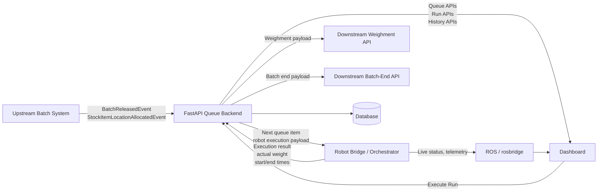

Batch weighment queue service

## Overview
This service should be a FastAPI microservice that sits between:

- an upstream batch system that emits webhook events
- the dashboard and robot system in this repository
- a downstream API that accepts weighment and batch-end requests

Its main job is to be the source of truth for queue and batch workflow state.
It should ingest upstream events, maintain the current FIFO queue in a database,
enrich queue items with stock-location data, expose queue state to the
dashboard, hand the next item to the robot, and finally post the completed
weighment and batch-end payloads downstream.

## Recommended Architecture
The backend should own the workflow state.
ROS should own robot execution.
The dashboard should read queue state from the backend and live telemetry from
ROS where needed.

Recommended split of responsibilities:

- Backend:
  - ingest upstream webhooks
  - persist queue, batch, and event state
  - expose queue and operator APIs
  - receive execution completion from the robot
  - perform downstream weighment and batch-end calls
  - persist inbound and outbound audit logs
- Robot / ROS:
  - execute the next queue item
  - move to the right location
  - scoop / weigh / pour according to the target
  - report completion and measured result back to the backend
- Dashboard:
  - show the active queue and completed items from the backend
  - let an operator start or continue runs
  - optionally show live robot status from ROS

## End-To-End Flow
At a high level, the workflow should be:

1. The upstream system sends a `BatchReleasedEvent` webhook to the FastAPI backend.
2. The backend stores the raw event, deduplicates by `eventId`, and rebuilds the queue for that batch.
3. The upstream system may also send `StockItemLocationAllocatedEvent` webhooks.
4. The backend stores the raw allocation event, deduplicates it, and enriches matching queue items with location information.
5. The dashboard requests the active queue from the backend and shows item order, target quantities, and location data.
6. The operator clicks `Execute Run` or `Start Run` from the dashboard.
7. The backend selects the next pending queue item and sends a robot-execution command to the robot system.
8. The robot orchestrator takes the queue item data, moves to the assigned source location, and performs the weighment run.
9. When the robot finishes, it sends the measured result and timestamps back to the backend.
10. The backend posts the completed weighment to the configured downstream weighment endpoint.
11. If the last queue item was completed successfully, the backend posts the batch-end payload to the downstream batch-end endpoint.
12. The backend updates queue state, completed items, and outbound request logs for dashboard visibility and audit.

## How The Robot Receives The Information
The robot should not read upstream webhooks directly.
The backend should transform queue items into a robot-friendly execution
payload, then hand that payload to the robot system.

Recommended robot handoff fields:

- `queueItemId`
- `batchId`
- `batchLineId`
- `stockItemId`
- `stockItemCode`
- `locationId`
- `locationCode`
- `targetKg`
- `sequence`
- optional run metadata such as `batchId`, `operator`, `startedBy`, or `runId`

Recommended robot completion payload:

- `queueItemId`
- `batchId`
- `actualKg`
- `targetKg`
- `startUtc`
- `endUtc`
- `energyKwh`
- optional robot metadata such as `robotId`, `executionStatus`, and `failureReason`

The transport from backend to robot can be one of:

- HTTP from backend to a robot-facing API
- ROS service or action invoked by a backend bridge service
- a small command queue table polled by a robot-side worker

For this repository, a practical design is:

- backend owns queue and business workflow
- a robot-side bridge subscribes or polls for the next queue item
- robot orchestrator executes that item
- robot posts completion back to backend

## System Diagram


## Services And Ports
- FastAPI backend: default local runtime is `http://127.0.0.1:5000`
- Downstream weighment endpoint: currently configured as `http://localhost:5002/batch/weightment`
- Downstream batch-end endpoint: currently configured as `http://localhost:5002/batch/end`

## State That Must Be Persistent
For production, the backend should persist:

- active and historical batches
- queue items and their states
- processed webhook event IDs
- inbound webhook payloads
- outbound request logs
- robot execution results

The backend should not delete queue items immediately after completion.
Instead, queue items should move through states such as:

- `pending`
- `enriched`
- `dispatched_to_robot`
- `robot_completed`
- `posted_downstream`
- `failed`

## Suggested Database Model
At minimum, use these tables:

### `batch_runs`
One row per active or recent batch.

Suggested fields:

- `id`
- `batch_id`
- `status`
- `started_at`
- `ended_at`
- `source_event_id`

### `queue_items`
One row per batch line.

Suggested fields:

- `id`
- `batch_run_id`
- `batch_line_id`
- `sequence`
- `stock_item_id`
- `stock_item_code`
- `location_id`
- `location_code`
- `target_kg`
- `actual_kg`
- `status`
- `robot_started_at`
- `robot_finished_at`
- `failure_reason`

### `event_log`
Immutable inbound event records.

Suggested fields:

- `id`
- `event_id`
- `event_type`
- `received_at`
- `payload_json`
- `processed`
- `processing_error`

### `outbound_request_log`
Immutable outbound API records.

Suggested fields:

- `id`
- `queue_item_id`
- `request_type`
- `url`
- `request_body_json`
- `response_status`
- `response_body_text`
- `attempt_count`
- `created_at`
- `completed_at`
- `success`
- `error_text`

## Webhook Endpoints
The upstream system should send webhook events to these backend routes:

- `POST http://localhost:5000/api/BatchReleasedEvent`
- `POST http://localhost:5000/api/StockItemLocationAllocatedEvent`

If `https://localhost:5000` is required, add TLS termination in front of
FastAPI using:

- a reverse proxy
- a local development certificate setup
- a load balancer or ingress in production

## Backend API Surface
### `POST /api/config/endpoints`
Configures the exact downstream URLs used for outbound requests.

Request body:

```json
{
  "weighmentUrl": "http://localhost:5002/batch/weightment",
  "batchEndUrl": "http://localhost:5002/batch/end"
}
```

### `POST /api/BatchReleasedEvent`
Receives the upstream batch release event and rebuilds the queue.

Behavior:

- stores the raw webhook payload
- deduplicates by `eventId`
- extracts batch metadata and lines
- converts each line into a queue item
- stores queue items transactionally

### `POST /api/StockItemLocationAllocatedEvent`
Receives stock allocation information and updates matching queue items.

Behavior:

- stores the raw webhook payload
- deduplicates by `eventId`
- extracts allocated stock item IDs and stock location data
- updates queue items whose `stockItemId` matches

### `GET /api/queue/current`
Returns the active batch and queue for the dashboard.

Suggested response fields:

- `activeBatchId`
- `queueLength`
- `completedCount`
- `nextWeighment`
- `remainingQueue`
- `completedQueue`
- `webhookStatus`

### `POST /api/actions/execute-run`
Starts execution of the next pending queue item.

Recommended behavior:

- selects the next queue item
- marks it `dispatched_to_robot`
- sends a robot-friendly execution payload to the robot system
- returns the selected queue item ID and execution request status

### `POST /api/actions/robot-complete`
Receives the robot completion result for a specific queue item.

Recommended behavior:

- accepts a specific `queueItemId`
- stores actual measured values and timestamps
- marks queue item `robot_completed`
- posts the weighment downstream
- if this was the last successful item, posts batch-end downstream

This is safer than an implicit `send-next` endpoint because it avoids ambiguity
about which queue item completed when retries or concurrent requests happen.

## BatchReleasedEvent Format
The backend currently supports the real payload shape you are receiving,
including lowercase keys such as:

- `batch`
- `lines`
- `id`
- `createdUtc`
- `parameters`
- `target`

The earlier uppercase style can still be supported where needed.

Example shape:

```json
{
  "eventId": "43de08ff-8b91-4c50-adfe-7acfc75be288",
  "sender": "promtek-service-batch",
  "batch": {
    "id": 22461,
    "startTimeUtc": "2026-03-12T12:38:30.3597196Z",
    "lines": [
      {
        "id": 497542,
        "sequence": 0,
        "weigherCode": "RW1",
        "parameters": [
          {
            "batchInstructionParameterCode": "Ingredient",
            "target": "1330"
          },
          {
            "batchInstructionParameterCode": "Quantity",
            "target": "0.5000000"
          }
        ]
      }
    ]
  }
}
```

Mapping into the internal queue:

- `batch.id` -> `batchId`
- `lines[].parameters[Ingredient].target` -> `stockItemId`
- `lines[].parameters[Quantity].target` -> `targetKg`
- `lines[].sequence` -> queue order
- `lines[].id` -> `batchLineId`
- `weigherCode` and related metadata are preserved for display and logging

Recommended defaults:

- `actualKg` should remain `null` until real robot completion data arrives
- `lotCode` can default to empty string until allocation data is received
- `energyKwh` can default to `0`
- `endUtc` should be written when execution finishes

## StockItemLocationAllocatedEvent Format
The backend currently supports the real allocation payload shape you shared,
including:

- `eventId`
- `stockItemLocationId`
- `stockItemLocationCode`
- `allocatedStockItems[].id`
- `allocatedStockItems[].code`

Example shape:

```json
{
  "eventId": "b918d9a1-a131-42e0-bea6-7e695a35ca14",
  "stockItemLocationId": 92,
  "stockItemLocationCode": "001",
  "allocatedStockItems": [
    {
      "id": 1327,
      "code": "RM-002"
    }
  ]
}
```

Mapping:

- `eventId` -> allocation event ID
- `stockItemLocationId` -> `locationId`
- `stockItemLocationCode` -> `locationCode`
- `allocatedStockItems[].id` -> `stockItemId`
- `allocatedStockItems[].code` -> `stockItemCode`

If a queue item has the same `stockItemId`, the backend updates that queue item
with the location information.

## Outbound Request Payloads
### Weighment Request
The backend posts the completed queue item in a shape like:

```json
{
  "batchId": 22461,
  "stockItemId": 1327,
  "lotCode": "",
  "targetKg": 0.15,
  "actualKg": 0.1492,
  "startUtc": "2026-03-12T12:38:31.0968685Z",
  "endUtc": "2026-03-12T12:45:00.000Z",
  "energyKwh": 0
}
```

### Batch End Request
After the last weighment succeeds, the backend posts:

```json
{
  "batchId": 22461,
  "endUtc": "2026-03-12T12:45:00.000Z"
}
```

### Test Batch End Directly
```bash
curl -X POST "http://localhost:5002/batch/end" \
  -H "Content-Type: application/json" \
  -d '{
    "batchId": 22461,
    "endUtc": "2026-03-12T12:39:50.670Z"
  }'
```

## Production Considerations
For production, strongly consider:

- persistent storage for batches, queue state, and processed event IDs
- immutable inbound webhook logs
- immutable outbound request logs
- authentication and authorization for operator actions
- webhook authentication or signature validation
- structured application logging
- observability and metrics
- outbound retry policy and dead-letter handling
- HTTPS termination and reverse proxy configuration
- deployment configuration such as Docker, systemd, or Kubernetes manifests
- automated tests for webhook parsing, idempotency, queue transitions, and outbound request behavior
