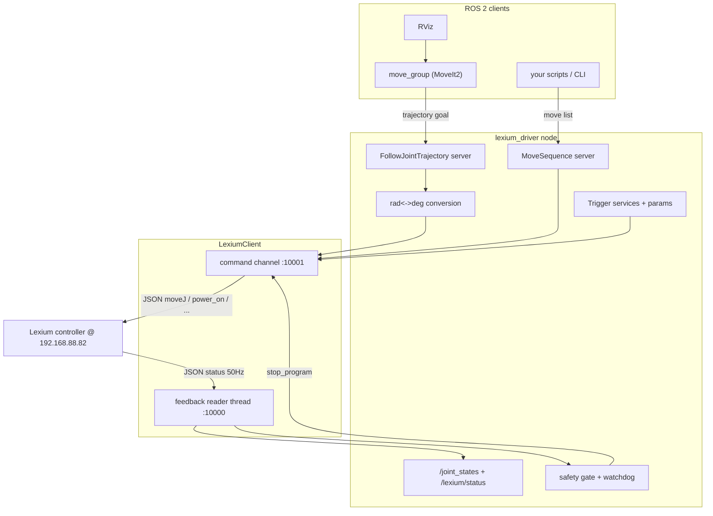
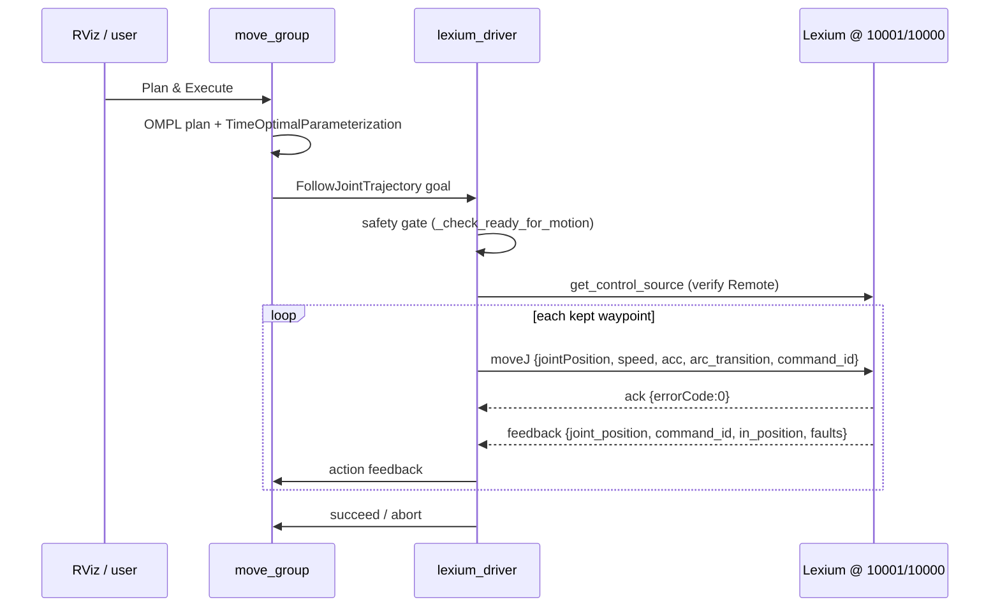
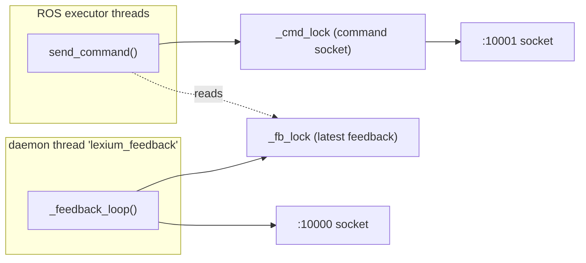

# Lexium Driver - Design and Safety Reference

This document is the deep, auditable reference for the `lexium_driver` and
`lexium_msgs` packages. It explains the architecture at a high level and then
walks through every module in detail, with references to real functions and
line ranges so the implementation can be inspected before use on production
hardware.

For quick-start/bringup, see [README.md](../README.md). This document assumes
you have read it.

> SAFETY NOTICE: This driver commands a real collaborative robot over the
> network. Read [Section 8 - Safety model](#8-safety-model) in full before
> commanding motion. The URDF-to-Lexium joint mapping
> (`joint_sign`/`joint_offset_deg`) MUST be verified on hardware with slow
> jogs before any trajectory is trusted.

---

## Table of contents

1. [Purpose and scope](#1-purpose-and-scope)
2. [System architecture (high level)](#2-system-architecture-high-level)
3. [Protocol reference (Schneider LexiumCobotCommunication)](#3-protocol-reference-schneider-lexiumcobotcommunication)
4. [Low-level walkthrough: LexiumClient](#4-low-level-walkthrough-lexiumclient)
5. [Low-level walkthrough: LexiumDriver node](#5-low-level-walkthrough-lexiumdriver-node)
6. [Trajectory execution (FollowJointTrajectory)](#6-trajectory-execution-followjointtrajectory)
7. [MoveSequence action (per-move speed)](#7-movesequence-action-per-move-speed)
8. [Safety model](#8-safety-model)
9. [Interfaces reference](#9-interfaces-reference)
10. [Build, run, and verification](#10-build-run-and-verification)

---

## 1. Purpose and scope

### What this replaces and why

The upstream `jaka_ros2` stack talks to the controller through the closed-source
JAKA SDK (`libjakaAPI.so`) via `login_in(ip, grpc_flag)`. On the Schneider
**Lexium Cobot** that login is rejected (TCP returns SDK error 2; gRPC returns
10014), so `jaka_driver` and `jaka_planner/moveit_server` cannot drive the arm.

The Lexium controller instead exposes Schneider's own **LexiumCobotCommunication**
protocol: line-free JSON over two TCP sockets:

- **Port 10001** - command channel, strict request/response.
- **Port 10000** - feedback stream, ~50 Hz JSON status.

`lexium_driver` is a from-scratch ROS 2 driver that speaks this protocol and
presents the same ROS interface MoveIt already expects, so the existing
`jaka_zu5_moveit_config` is reused unchanged.

### Scope

- Two packages: `lexium_msgs` (interfaces) and `lexium_driver` (the node + a
  standalone TCP client library).
- In scope: joint trajectory execution from MoveIt, a low-level per-move action,
  power/enable/error/stop services, joint-state + status publishing, and safety
  gating.
- Out of scope: TLS transport (`ConnectTLS`), Cartesian servoing/streaming
  velocity control (the protocol has no coordinated velocity-streaming command),
  and gripper/IO control (not implemented here).

---

## 2. System architecture (high level)

### Components



### Packages and roles

| Package | Build type | Role |
|---------|-----------|------|
| `lexium_msgs` | ament_cmake (rosidl) | `LexiumStatus.msg`, `MoveCommand.msg`, `MoveSequence.action` |
| `lexium_driver` | ament_python | `lexium_tcp.py` (TCP/JSON client) + `lexium_driver_node.py` (the node) + config/launch |

### How it slots into MoveIt unchanged

MoveIt's `MoveItSimpleControllerManager` is configured in
[jaka_zu5_moveit_config/config/moveit_controllers.yaml](../../jaka_zu5_moveit_config/config/moveit_controllers.yaml)
to talk to a controller named `jaka_zu5_controller` on action namespace
`follow_joint_trajectory`. The driver hosts exactly that action at
`/jaka_zu5_controller/follow_joint_trajectory`
([lexium_driver_node.py](../lexium_driver/lexium_driver_node.py) lines 155-163),
so MoveIt needs no changes. `lexium_driver` is a drop-in replacement for the
old `jaka_planner/moveit_server`.

The combined launch
[lexium_moveit.launch.py](../launch/lexium_moveit.launch.py) starts the driver
and then includes `generate_demo_launch(...)` with `use_rviz_sim:=false` so no
mock `ros2_control` hardware is started; MoveIt plans and executes against the
real robot through the action server.

### End-to-end execution sequence



---

## 3. Protocol reference (Schneider LexiumCobotCommunication)

### Command channel - TCP 10001 (request/response)

- The driver sends one JSON object `{"cmdName": "...", ...}` and waits for one
  JSON acknowledgement before sending the next. This single-in-flight rule is
  enforced by a lock (see Section 4).
- Acknowledgement shape: `{"errorCode": "0", "errorMsg": "", "cmdName": "..."}`
  plus command-specific fields. Any `errorCode` other than `"0"`/`""` is treated
  as an error.

Commands the driver emits (all units **degrees** and **mm**):

| Command | Purpose | Emitted from |
|---------|---------|--------------|
| `get_control_source` | read control source (1 Stick / 2 App / 3 Remote) | startup + poll + pre-motion gate |
| `power_on` / `power_off` | energize / de-energize arm | services / startup |
| `enable_robot` / `disable_robot` | enable / disable arm | services / startup |
| `clear_error` | clear collision/advisory | service |
| `stop_program` | stop motion / program | safety, cancel, shutdown, services |
| `set_speed_rate` | global speed override (0..1) | startup + per-trajectory |
| `moveJ` | joint move to `jointPosition` (deg) | trajectory + sequence |
| `moveL` / `moveTCP` / `moveC` | cartesian / circular moves | MoveSequence only |

### Feedback channel - TCP 10000 (~50 Hz stream)

Concatenated JSON objects (no delimiter). Fields the driver consumes:

| Field | Type | Used for |
|-------|------|----------|
| `joint_position` | float[6] deg | `/joint_states`, goal-reached check |
| `enabled` | bool | gate / status |
| `powered_on` | int 0/1 | gate / status |
| `in_position` | bool | move-complete detection |
| `command_id` | int | which move is active/done |
| `protective_stop` | int 0/1 | fault |
| `emergency_stop` | int 0/1 | fault |
| `collision_stop` | int 0/1 | fault |
| `on_soft_limit` | int 0/1 | fault |
| `error_code` / `error_msg` | string | status reporting |

### CRITICAL protocol fact: control_source is NOT in feedback

`control_source` is only returned by the `get_control_source` **command**; it is
**not** a field in the 10000 feedback stream. An earlier version read it from
feedback, so it was always `0` and motion was wrongly rejected even when the arm
was in Remote. The driver now **polls `get_control_source` (~1 Hz) and caches it**,
and re-queries it at goal acceptance time. See `_query_control_source`,
`_poll_control_source` ([lexium_driver_node.py](../lexium_driver/lexium_driver/lexium_driver_node.py)
lines 231-247) and the gate at lines 325-331.

---

## 4. Low-level walkthrough: LexiumClient

File: [lexium_tcp.py](../lexium_driver/lexium_driver/lexium_tcp.py) (225 lines).
This module is pure Python (no ROS dependency) so it can be unit-tested or
reused standalone.

### Threading model



- `_cmd_lock` (line 52) guarantees one request/response on 10001 at a time,
  even though multiple ROS callbacks may call `send_command` (parameter changes,
  services, the trajectory loop). This is what enforces the protocol's
  single-in-flight rule.
- A dedicated daemon thread (`start()`, lines 66-73) runs `_feedback_loop`; the
  latest decoded object is shared under `_fb_lock` (line 58).

### Command path

- `send_command(command, raise_on_error=True)` (lines 112-138): serializes the
  dict to compact JSON, (re)connects if needed, calls `_send_locked`, and - if
  `raise_on_error` - raises `LexiumError` when `errorCode` is not `"0"`/`""`.
  On any `OSError`/`ValueError` it drops the socket so the next call reconnects,
  then re-raises.
- `_send_locked(payload)` (lines 140-153): `sendall`, then loops reading 4 KB
  chunks until a full JSON object is decoded or `command_timeout` (10 s) is hit
  (`TimeoutError`). A zero-length recv means the controller closed the socket
  (`ConnectionError`).
- `_try_decode_cmd_buf()` (lines 155-167): incremental framing via
  `json.JSONDecoder.raw_decode` on the left-stripped buffer; consumed bytes are
  removed so any trailing partial object remains buffered.

### Feedback path

- `_feedback_loop()` (lines 172-199): connect, 2 s socket timeout (so it can
  re-check `_running`), read 8 KB chunks, drain into objects; on any error it
  closes and retries after `reconnect_backoff` (1 s). It never raises into the
  node.
- `_drain_feedback()` (lines 201-213): decodes as many whole objects as the
  buffer contains, keeping only the **newest** in `_fb_state` with a monotonic
  timestamp; returns the trailing partial bytes.
- `get_feedback()` (215-217) returns a copy of the latest object;
  `feedback_age()` (219-224) returns seconds since the last object (`inf` if
  none) - this is the comms watchdog used throughout the node.

### `raise_on_error` semantics

- `True` (default): used for commands where failure must surface (e.g. `moveJ`,
  `get_control_source`, the service triggers).
- `False`: used by `_safe_cmd` for `stop_program` during fault/abort handling so
  that stopping never itself raises.

### Failure modes

| Condition | Detection | Effect |
|-----------|-----------|--------|
| Controller closes command socket | empty recv -> `ConnectionError` | socket dropped, caller sees error, reconnect next call |
| Partial/garbage JSON on 10001 | `raw_decode` `ValueError` | keep buffering until timeout |
| No ack within 10 s | deadline in `_send_locked` | `TimeoutError`, socket dropped |
| Controller error code | `errorCode != 0` | `LexiumError` (if `raise_on_error`) |
| Feedback socket loss | exception in `_feedback_loop` | reconnect after backoff; `feedback_age` grows -> watchdog trips |

---

## 5. Low-level walkthrough: LexiumDriver node

File: [lexium_driver_node.py](../lexium_driver/lexium_driver/lexium_driver_node.py)
(808 lines). Class `LexiumDriver(Node)`.

### Parameters (declared in `__init__`, lines 48-127)

Defaults below match both the code and
[config/lexium_driver.yaml](../config/lexium_driver.yaml).

| Parameter | Type | Default | Meaning |
|-----------|------|---------|---------|
| `ip` | string | `192.168.88.82` | controller IP |
| `command_port` | int | `10001` | command channel port |
| `feedback_port` | int | `10000` | feedback stream port |
| `joints` | string[] | `joint_1..joint_6` | ROS joint names / order |
| `controller_name` | string | `jaka_zu5_controller` | action namespace prefix |
| `joint_sign` | float[6] | all `1.0` | per-joint direction (URDF<->Lexium) |
| `joint_offset_deg` | float[6] | all `0.0` | per-joint zero offset (deg) |
| `move_speed_deg` | float | `30.0` | moveJ speed cap (deg/s) |
| `move_acc_deg` | float | `60.0` | moveJ accel cap (deg/s^2) |
| `speed_from_trajectory` | bool | `true` | per-segment speed from plan (fallback path) |
| `min_move_speed_deg` | float | `2.0` | per-segment speed floor |
| `speed_rate_from_trajectory` | bool | `true` | derive global `set_speed_rate` from plan |
| `max_joint_speed_degps` | float | `90.0` | reference max joint speed (=1.57 rad/s) |
| `min_speed_rate` | float | `0.02` | floor for derived global override |
| `arc_transition_deg` | float | `2.0` | blend radius (blended mode) |
| `downsample_threshold_deg` | float | `15.0` | keep waypoint when any joint moves this much |
| `execution_mode` | string | `blended` | `blended` or `sequential` |
| `goal_tolerance_deg` | float | `1.0` | per-joint reached tolerance |
| `inter_command_delay` | float | `0.02` | pause between pipelined moves (s) |
| `feedback_timeout` | float | `1.0` | stale-feedback watchdog (s) |
| `require_remote_control` | bool | `true` | require control_source==3 before motion |
| `auto_power_on` | bool | `false` | auto power on at startup |
| `auto_enable` | bool | `false` | auto enable at startup |
| `speed_rate` | float | `0.1` | conservative startup speed override (0..1) |
| `motion_wait_timeout` | float | `60.0` | max wait to reach a target (s) |

### Concurrency / executor

- Runs under a `MultiThreadedExecutor` (`main`, line 793) with a single
  `ReentrantCallbackGroup` (line 149) so the blocking action execute callbacks,
  the 50 Hz state timer, and the 1 Hz control-source poll can run concurrently.
- Two timers: `_publish_state` at 0.02 s (line 186) and `_poll_control_source`
  at 1.0 s (line 188).
- `_startup` runs on its own thread (line 191) so the constructor returns
  immediately and connection latency does not block node setup.
- `_goal_lock` (line 142) + `_active_goal` (line 143) enforce a single active
  goal across BOTH action servers (trajectory and sequence); the control-source
  poll also skips while a goal is active (lines 242-245) to avoid interleaving
  commands on 10001.

### Joint conversion (lines 285-297)

```
ros_to_lexium:  deg = joint_sign[i] * (rad * 180/pi) + joint_offset_deg[i]
lexium_to_ros:  rad = ((deg - joint_offset_deg[i]) / joint_sign[i]) * pi/180
```

`_lexium_to_ros` guards against a zero sign (treats 0 as 1, line 295) so a
mis-set parameter cannot divide by zero. These two functions are the single
place the URDF<->Lexium calibration is applied; `MoveSequence` deliberately
bypasses them (raw protocol units).

### Startup sequence `_startup()` (lines 196-229)

1. `client.start()` - open both channels; on failure, log and return (node
   stays up, publishes "not connected").
2. Wait up to 5 s for the first feedback object.
3. `get_control_source` and warn if not Remote when `require_remote_control`.
4. Optional `auto_power_on` / `auto_enable` (both default off).
5. Apply the conservative `speed_rate` (default 0.1) via `set_speed_rate`.

### State publishing `_publish_state()` (lines 252-280)

- If feedback has `joint_position`, publish `/joint_states` in radians (via
  `_lexium_to_ros`).
- Always publish `/lexium/status`: `connected`, `feedback_fresh` (age <=
  `feedback_timeout`), cached `control_source`, and the power/enable/in_position
  + fault flags + error strings + `command_id` from the latest feedback.

---

## 6. Trajectory execution (FollowJointTrajectory)

Entry: action server at `/jaka_zu5_controller/follow_joint_trajectory`
(lines 155-163). Goal lifecycle: `_handle_goal` -> `_execute_trajectory` ->
`_run_trajectory`; cancel via `_handle_cancel`.

### Goal acceptance `_handle_goal()` (lines 344-356)

Rejects if another goal is active, if `_check_ready_for_motion()` returns a
reason (see Section 8), or if the trajectory is empty. Otherwise ACCEPT.

### Execution `_run_trajectory()` (lines 375-486)

1. **Joint reorder (380-387):** build `index_map` from the goal's
   `joint_names` to `self.joints`. A missing joint -> `INVALID_JOINTS` abort.
2. **Build waypoints + peaks (389-406):** for each trajectory point, convert
   positions to Lexium degrees and record the per-point peak `|velocity|` and
   peak `|acceleration|` (deg units). Points without velocities record 0.
3. **Downsample (408, `_downsample_indices` 503-514):** keep the first and last
   point, and any intermediate point where some joint has moved at least
   `downsample_threshold_deg` since the last kept point. Fewer waypoints means
   longer `moveJ` segments where the arm reaches cruise speed.
4. **Speed strategy (413-419):**
   - If `speed_rate_from_trajectory` (default): compute
     `rate = traj_peak_speed / max_joint_speed_degps`, clamp to
     `[min_speed_rate, 1.0]`, and apply it once via `set_speed_rate`. Then each
     `moveJ` is sent at the full `move_speed_deg`/`move_acc_deg` caps
     (`use_full_caps=True`) and the global rate does the scaling. Because
     `set_speed_rate` scales acceleration too, the MoveIt velocity slider stays
     effective even on short, acceleration-limited segments.
   - Else `_segment_speed_acc` (488-501) derives per-segment speed/acc from the
     planned peak values, capped by `move_speed_deg`/`move_acc_deg`, floored by
     `min_move_speed_deg`.
5. **Per-waypoint loop (428-475):** safety `_guard` before each send; build and
   send `moveJ` with an incrementing `command_id`. `arc_transition` is 0 for the
   last point and in `sequential` mode (stop at point), else
   `arc_transition_deg` (blend). In `blended` mode the next move is pipelined
   after `inter_command_delay`; in `sequential` mode it waits via
   `_wait_until_reached`.
6. **Final wait (478-480):** `_wait_until_reached` on the last target.
7. **Result (482-486):** `succeed()` with `SUCCESSFUL`.
8. **Restore (in `_execute_trajectory` finally, 368-373):** if
   `speed_rate_from_trajectory`, restore the configured `speed_rate` so the
   per-trajectory override does not leak into later jogs/sequences.

### Reaching a target `_wait_until_reached()` (lines 550-581)

Loops: `_guard` first; then if feedback shows all joints within
`goal_tolerance_deg` AND (`in_position` OR feedback `command_id >= command_id`),
returns done. Publishes action feedback (actual positions in radians). Times out
after `motion_wait_timeout` -> `GOAL_TOLERANCE_VIOLATED` abort + `stop_program`.

### Why short segments looked "same speed"

`moveJ speed` is a max cap, not a target. On a ~3 deg segment the arm is
acceleration-limited and never reaches the velocity cap, so changing the
velocity scaling alone had little visible effect. The two mitigations are:
(a) `speed_rate_from_trajectory` (scales acceleration too) and
(b) a larger `downsample_threshold_deg` (default 15) so segments are long enough
to reach cruise speed.

### Timing limitation

`moveJ` has no duration argument; the controller plans its own trapezoidal
profile per segment. The path and relative speeds are honoured, but MoveIt's
exact time parameterization is not reproduced.

---

## 7. MoveSequence action (per-move speed)

Action: `/lexium_driver/move_sequence` (type `lexium_msgs/action/MoveSequence`,
registered lines 166-174). This is the low-level interface for "go to these
poses, each at its own speed".

### Interface

`MoveCommand.msg` ([msg/MoveCommand.msg](../../lexium_msgs/msg/MoveCommand.msg)):

| Field | Meaning |
|-------|---------|
| `move_type` | `moveJ` / `moveL` / `moveTCP` / `moveC` (default `moveJ`) |
| `target` | 6 joint deg (moveJ) or `[x,y,z,rx,ry,rz]` mm/deg (cartesian) |
| `circ` | moveC only: via pose |
| `speed` | deg/s or mm/s; `<= 0` -> driver default `move_speed_deg` |
| `acc` | deg/s^2 or mm/s^2; `<= 0` -> driver default `move_acc_deg` |
| `arc_transition` | 0 = stop at point (clean speed change); > 0 = blend |
| `rel_flag` | 0 = absolute |

`MoveSequence.action`
([action/MoveSequence.action](../../lexium_msgs/action/MoveSequence.action)):
goal `MoveCommand[] moves`; result `success/message/completed`; feedback
`current_index/total/active_command_id`.

### Execution `_run_move_sequence()` (lines 617-674)

- `_handle_sequence_goal` applies the same pre-motion gate and single-goal rule.
- For each move: `_motion_problem` check; build the command via
  `_build_move_cmd` (689-722, validates array lengths per move type, raises
  `ValueError` -> abort); send with an incrementing `command_id`; publish
  feedback.
- If `arc_transition > 0` and not last: pipeline (sleep `inter_command_delay`)
  to blend; otherwise `_wait_for_command` (724-737) waits until feedback
  `in_position` and `command_id >= cid`.
- `_finish_sequence` (676-687) handles cancel/abort uniformly with
  `stop_program`.

### Units

`MoveCommand` values are sent **verbatim** in protocol units and are NOT remapped
by `joint_sign`/`joint_offset_deg` (unlike trajectory execution). This is called
out in the message comments and matters for safety review: a `moveJ` here is in
the Lexium's own joint frame.

---

## 8. Safety model

This section is the priority for hardware review.

### Pre-motion gate `_check_ready_for_motion()` (lines 316-339)

Both action servers call this at goal acceptance. Motion is refused (goal
REJECTED) unless ALL hold:

| Condition | Reason |
|-----------|--------|
| command channel connected | cannot command otherwise |
| `feedback_age <= feedback_timeout` | stale feedback = comms loss |
| feedback present | need state to gate on |
| `control_source == 3` (Remote) when `require_remote_control` | re-queried live via `get_control_source` |
| `powered_on` | arm must be energized |
| `enabled` | arm must be enabled |
| no active faults | see fault list below |

### In-motion monitor `_motion_problem()` / `_guard()` (lines 516-548)

Checked before every command send and on every wait iteration:

- `rclpy` shutting down -> abort + `stop_program`.
- Cancel requested -> cancel + `stop_program`.
- `feedback_age > feedback_timeout` -> abort (comms loss) + `stop_program`.
- Any fault flag set (`protective_stop`, `emergency_stop`, `collision_stop`,
  `on_soft_limit`; `_active_faults` 302-314; missing feedback counts as
  `no_feedback`) -> abort + `stop_program`.

`_guard` returns a `FollowJointTrajectory.Result`; `_motion_problem` returns a
`(kind, reason)` tuple reused by the MoveSequence path via `_finish_sequence`.

### Other safety properties

- **Watchdog:** `feedback_age()` (from the TCP client) is the single source of
  truth for comms liveness; both the gate and the in-motion monitor use it.
- **Timeouts:** `_wait_until_reached` / `_wait_for_command` abort after
  `motion_wait_timeout` (60 s) and issue `stop_program`.
- **Single-goal invariant:** `_goal_lock` + `_active_goal` prevent two
  trajectories or a trajectory + sequence overlapping.
- **Conservative startup speed:** `set_speed_rate(speed_rate=0.1)` on startup;
  per-trajectory override is restored afterwards.
- **Shutdown:** `main()` finally (lines 799-803) sends `stop_program` then
  destroys the node; `destroy_node` (782-787) stops the TCP client (closes
  sockets, joins the feedback thread).
- **stop never raises:** `_safe_cmd` sends `stop_program` with
  `raise_on_error=False` so stopping during a fault cannot itself throw.

### Known limitations / residual risks (read before production)

- **Joint calibration is unverified by default.** `joint_sign`/`joint_offset_deg`
  default to identity. If the URDF zero/direction differs from the Lexium, the
  arm will move differently from RViz. MUST be checked with slow jogs first.
- **No TLS.** The client uses plain `Connect` (port 10001/10000), not
  `ConnectTLS`. Use only on a trusted/isolated network.
- **Timing is approximate.** See Section 6; `moveJ` has no duration.
- **`require_remote_control` rationale.** Defaults true; disabling it removes the
  Remote-control precondition and is not recommended on hardware.
- **Not protected against:** incorrect URDF/collision model, payload/TCP
  mis-configuration on the controller, planning-scene gaps, or workspace
  obstacles not modelled in MoveIt. The driver enforces controller-reported
  faults and comms health, not application-level collision avoidance.

---

## 9. Interfaces reference

### Topics (published)

| Topic | Type | Notes |
|-------|------|-------|
| `/joint_states` | `sensor_msgs/JointState` | radians, ~50 Hz |
| `/lexium/status` | `lexium_msgs/LexiumStatus` | structured status, ~50 Hz |

### Actions (servers)

| Action | Type | Notes |
|--------|------|-------|
| `/jaka_zu5_controller/follow_joint_trajectory` | `control_msgs/FollowJointTrajectory` | MoveIt entry point |
| `/lexium_driver/move_sequence` | `lexium_msgs/MoveSequence` | per-move speed list |

### Services (`std_srvs/Trigger`, under `/lexium_driver/`)

`power_on`, `power_off`, `enable`, `disable`, `clear_error`, `stop`.

### Parameters

See the table in Section 5. `speed_rate` is dynamically settable
(`_on_set_parameters`, lines 775-780) and applies `set_speed_rate` immediately.

---

## 10. Build, run, and verification

### Build

```bash
cd ~/jaka_ros2
source /opt/ros/jazzy/setup.bash
colcon build --packages-select lexium_msgs lexium_driver
source install/setup.bash
```

### Run

Driver + MoveIt + RViz (one command):

```bash
ros2 launch lexium_driver lexium_moveit.launch.py ip:=192.168.88.82
```

Driver only:

```bash
ros2 launch lexium_driver lexium_driver.launch.py ip:=192.168.88.82
```

Do NOT also run `jaka_driver` or `jaka_planner moveit_server` - only one process
may own the controller connection.

### Pre-flight checklist (before any motion)

```bash
ros2 topic echo /lexium/status --once
```

Confirm: `connected: true`, `feedback_fresh: true`, `control_source: 3`,
`powered_on: true`, `enabled: true`, and all fault flags `false`. Use the
services to power on / enable if needed:

```bash
ros2 service call /lexium_driver/power_on std_srvs/srv/Trigger
ros2 service call /lexium_driver/enable   std_srvs/srv/Trigger
```

### Joint mapping verification (mandatory first step on hardware)

1. With control source Remote, powered + enabled, send a small single-joint
   `moveJ` via `/lexium_driver/move_sequence` at low speed.
2. Compare the real motion direction/zero against RViz `/joint_states`.
3. Adjust `joint_sign` / `joint_offset_deg` in
   [config/lexium_driver.yaml](../config/lexium_driver.yaml) until they match.

### Staged speed ramp-up

| Stage | RViz Velocity | RViz Accel | `speed_rate` |
|-------|---------------|------------|--------------|
| 1 | 0.05 | 0.05 | 0.05 |
| 2 | 0.10 | 0.10 | 0.10 |
| 3 | 0.20 | 0.20 | 0.15-0.20 |
| 4 | 0.50 | 0.50 | 0.30+ |

Re-Plan after changing the RViz sliders (scaling is applied at plan time). Set
`speed_rate` live with:

```bash
ros2 param set /lexium_driver speed_rate 0.10
```
