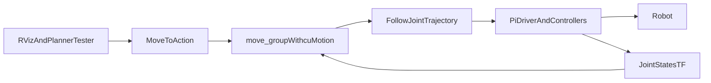

# NVIDIA cuMotion Experiment

This note captures how to evaluate NVIDIA `cuMotion` in this repo without disturbing the current Pi-first production stack.

## Goal

Test whether `cuMotion` is a better planner for the scoop-to-weigh transport stage than the current options:

- `OMPL` / `RRTConnect`
- `STOMP`
- `Pilz`
- `Cartesian Path`

The main interest is whether `cuMotion` can improve transport planning quality or success rate for the carry motion after scooping.

## Current Reality In This Repo

Today the physical scooping stack launches `move_group` on the Pi as part of the `scooping_stack` container:

- `docker-compose.robot-prod.yml`
- `src/scooping_controller/launch/scooping_real.launch.py`

That is fine for the current CPU planners, but it is not the right place to run `cuMotion`. `cuMotion` is an NVIDIA / Isaac ROS planner and should run on the workstation that has the NVIDIA GPU.

## Recommended Experiment Architecture

Keep robot execution on the Pi, but move planning onto the NVIDIA workstation.

## Why This Split Is Needed

- The current production compose starts `scooping_real.launch.py` on the Pi.
- That launch creates `move_group` inline.
- `cuMotion` needs GPU-backed runtime on the NVIDIA machine.
- The repo already supports per-request planner selection in `MoveTo`, so planner plumbing is mostly ready once the runtime split exists.

## What Already Helps

The planner tester is already modular:

- `src/robot_common_msgs/action/MoveTo.action` carries `planning_pipeline` and `planner_id`
- `src/robot_moveit/src/move_to_server.cpp` applies them per request
- `src/scooping_controller/src/scooping_panel.cpp` already exposes a planner dropdown

That means `cuMotion` does not need a redesign of the RViz testing flow. It mostly needs runtime and MoveIt integration work.

## What cuMotion Will Need

At minimum, the experiment will need:

- NVIDIA Isaac ROS `cuMotion` packages on the workstation
- a MoveIt planning pipeline entry for `cuMotion`
- a plain `URDF` artifact for the Niryo arm
- an `XRDF` for the Niryo arm
- a workstation-side launch that runs `move_group` and planning nodes
- live access from the workstation to Pi topics/actions such as:
  - `/joint_states`
  - `/tf`
  - `/tf_static`
  - trajectory execution action

## Repo Areas Likely To Change Later

If the experiment moves past documentation, the main files are likely:

- `src/scooping_controller/launch/scooping_real.launch.py`
- `src/scooping_controller/launch/scooping_simulation.launch.py`
- `src/niryo_ned_moveit_configs/niryo_ned3pro_moveit_config/`
- `src/scooping_controller/src/scooping_panel.cpp`
- `docker-compose.robot-prod.yml`

## Main Risk

The main technical risk is not the planner dropdown. It is the runtime split.

Right now planning and execution are bundled together on the Pi. For `cuMotion`, the experiment should treat that as the first problem to solve.

The second big risk is robot asset prep: this repo does not currently contain a Niryo `XRDF`.

## Minimal First Milestone

The first good experiment is:

1. Run `move_group` on the NVIDIA workstation.
2. Add `cuMotion` as a MoveIt planning pipeline.
3. Keep the Pi responsible for robot state and trajectory execution.
4. Verify one unconstrained `MoveTo` preview from RViz.
5. Only after that, test scoop-to-weigh transport planning.

## Success Criteria

Call the `cuMotion` experiment useful only if it can do all of the following:

- connect cleanly to the existing robot state / execution stack
- plan from the existing RViz `MoveTo` tester
- produce a valid preview path
- execute at least one real transport-related motion without making the deployment story worse than the current stack

## Recommendation

Do not replace the current production planning path first.

Treat `cuMotion` as an opt-in workstation experiment until it proves:

- easier deployment than the current Pi-only stack is not required
- transport planning quality is meaningfully better
- the added GPU and Isaac ROS dependency burden is worth it
