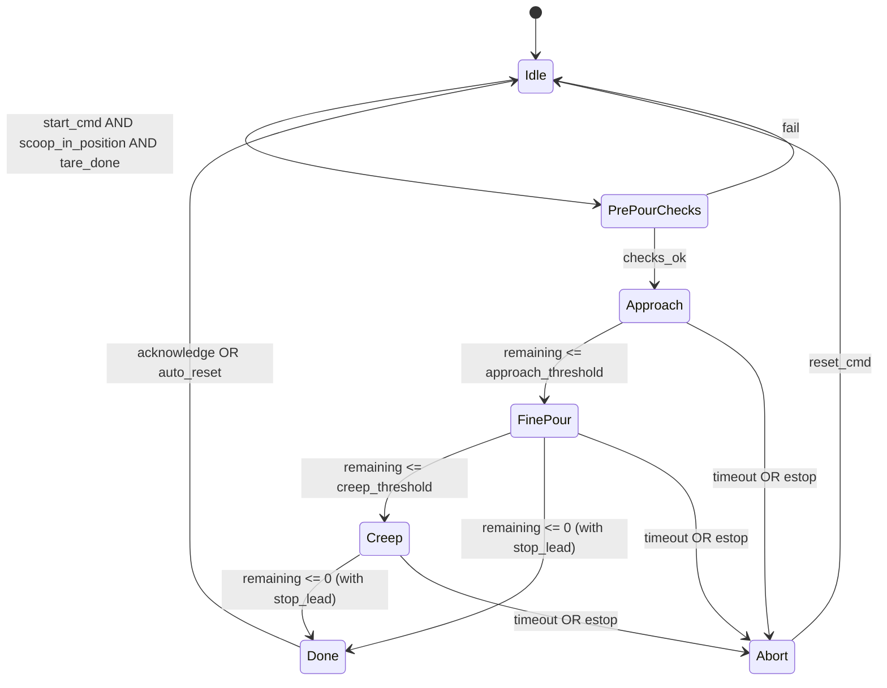

# micro-ROS Vibration Planning Reference

Stored copy of the user-provided vibration planning note for future design and integration work.

## Integration Notes For This Repo

This repo now uses one normalized host-side vibration interface:

- `pouring_controller` publishes normalized commands to `/vibration/intensity` as `std_msgs/msg/Float64`
- `scooping_controller` can issue a short post-lift shake-off burst on `/vibration/intensity`
- `robot_orchestrator` still has a `VibrateNode`, but it now publishes normalized `Float64` values to `/vibration/intensity`

The provided micro-ROS design matches the current actuator interface:

- topic: `/vibration/intensity`
- message: `std_msgs/msg/Float64`
- command range: `0.0 .. 1.0`

The remaining integration focus is no longer topic migration, but ownership and tuning:

1. Keep `pouring_controller` as the authoritative vibration owner during active pour control.
2. Use `scooping_controller` only for short shake-off bursts outside the pour phase.
3. Avoid overlapping publishers from BT cleanup actions and the pouring controller at the same time.

Recommended integration points:

- `scooping_controller`: post-lift or pre-transport shake-off step
- `pouring_controller`: closed-loop dispense control using load-cell feedback
- `robot_orchestrator`: high-level sequencing only, not low-level vibration control

Most important architectural rule from this note:

- one authoritative host-side dispense controller should own the vibration lifecycle during pouring
- high-level BT/orchestrator nodes should request actions and phases, but should not fight the low-level vibration controller

---

# Powder dispense control — planning & requirements

High-level specification for a **ROS 2 host node** that closes the loop between a **load cell** (mass on table) and **vibration intensity** on the scoop robot (`/vibration/intensity` -> Teensy). This document is a **planning / requirements** sketch for implementation, not shipped firmware.

---

## 1. Purpose

- Dispense powder from a **vibrating scoop** until **target mass** is collected on a **vessel weighed by a load cell** on the table.
- Cope with **transport delay** (scoop -> pan), **material-dependent flow**, and **moderate measurement noise** without requiring vibration-isolated weighing (vibration is on the scoop; cell is on the table).

---

## 2. Scope & assumptions

| Item | Assumption |
|------|------------|
| Actuator | `std_msgs/Float64` on `/vibration/intensity` (0-1), with host publishing at >= watchdog rate if Teensy timeout is enabled. |
| Sensor | Load cell mass (or weight) available on the host as a ROS topic or driver API, **synchronously or at fixed rate** (e.g. 20-100 Hz). |
| Robot | Scoop is positioned over the collection vessel before **Pouring** states begin; arm motion during pour is minimal or gated (see Section 7). |
| Materials | **Recipe / material ID** is known at start of cycle to select gains and feedforward (see Section 6). |

**Out of scope (initial version):** Multi-hopper selection, vision, automatic material identification.

---

## 3. Architecture (logical)

```text
┌─────────────────┐     mass (filtered)      ┌──────────────────────────────┐
│ Load cell       │ ───────────────────────► │ Dispense controller node     │
│ (host driver)   │                          │ (state machine + PI/FF/dosed)│
└─────────────────┘                          └──────────────┬───────────────┘
                                                              │
                                                              │ Float64 0..1
                                                              ▼
                                              ┌──────────────────────────────┐
                                              │ /vibration/intensity          │
                                              │ -> Teensy (L298N + watchdog)  │
                                              └──────────────────────────────┘
```

- **Single authoritative node** owns the pour lifecycle, subscribes to mass, publishes vibration at keepalive rate when active.
- Optional services/actions: `start_dispense(target_kg, material_id)`, `abort`, `get_status`.

---

## 4. State machine — overview

Phases split **fast approach**, **continuous fine control**, **dosed creep** near target, and **done / abort**. Transitions use **filtered mass**, **remaining mass**, and optionally **estimated mass rate** (dm/dt).

### 4.1 Diagram (Mermaid)



### 4.2 ASCII (same logic)

```text
                    ┌─────────┐
                    │  Idle   │
                    └────┬────┘
                         │ start + ready
                         ▼
                 ┌───────────────┐
                 │ PrePourChecks │
                 └───────┬───────┘
                         │ ok
                         ▼
                 ┌───────────────┐
      ┌──────────│   Approach    │◄─────────┐
      │ timeout  └───────┬───────┘          │
      │                  │ rem ≤ A_th       │
      ▼                  ▼                  │
 ┌─────────┐      ┌───────────────┐         │
 │  Abort  │      │   FinePour    │         │
 └────┬────┘      └───────┬───────┘         │
      │                   │ rem ≤ C_th      │
      │                   ▼                  │
      │            ┌───────────────┐         │
      │            │     Creep     │         │
      │            └───────┬───────┘         │
      │                    │ rem ≤ 0 + lead  │
      │                    ▼                  │
      │             ┌───────────────┐         │
      └────────────►│     Done      │         │
                    └───────┬───────┘         │
                            └────────────────► Idle
```

---

## 5. State definitions (requirements)

### 5.1 `Idle`

- **Vibration command:** `0` (or stop stream per Teensy policy).
- **Entry:** Reset integrators, timers, and "in-flight" estimate.
- **Exit:** On validated **start** command (target mass, material profile, optional tare).

### 5.2 `PrePourChecks`

- **Purpose:** Fail fast before energizing vibrator.
- **Checks (examples):** scoop over vessel, load cell stable after tare, no estop, target > 0, material profile loaded.
- **Failure ->** `Idle` or `Abort` with reason code.

### 5.3 `Approach`

- **Purpose:** Reduce remaining mass quickly while limiting overshoot risk.
- **Control:** **Fixed or scheduled high PWM** (below material max), **or** PI with **conservative gains** and **slew limit** on PWM.
- **Exit when:** `remaining_mass = target - mass_filtered <= A_th` (configurable, e.g. 5-15% of target or absolute grams).
- **Timeout:** If remaining not decreasing (dm/dt ~ 0) for `T_approach`, -> `Abort` (empty scoop, clog, wrong position).

### 5.4 `FinePour`

- **Purpose:** Continuous closed loop with **PI + feedforward** (per Section 6).
- **Inputs:** `e = remaining_mass`, optional `dm/dt` (filtered).
- **Output:** `/vibration/intensity` in [0, `u_max_fine`], published at keepalive rate.
- **Anti-windup:** Integrator clamped when output saturates.
- **Stop lead:** When predicted `mass + m_in_flight >= target - ε`, command **0** (use early cut-off from Section 6.3).
- **Exit when:** `remaining <= C_th` -> **Creep**, or success -> **Done**, or abort conditions.

### 5.5 `Creep`

- **Purpose:** **Dosed** delivery for last grams (see **Section 10 Glossary**).
- **Control:** Short pulses of vibration at **capped PWM** (`u_max_creep < u_max_fine`) or fixed **pulse width**; **optional** pause between pulses to read settled mass (only if needed for your filter rate).
- **Exit when:** same stop-lead logic as `FinePour` with tighter `ε`.
- **Max pulses / timeout:** Prevent infinite loop -> `Abort`.

### 5.6 `Done`

- **Vibration:** `0`.
- **Publish** final mass, error vs target, log recipe id.
- **Return to `Idle`** on operator ack or after delay.

### 5.7 `Abort`

- **Vibration:** `0` immediately.
- **Publish** reason (timeout, estop, sensor fault, invalid command).
- **-> `Idle`** on reset.

---

## 6. Control law (per-state expectations)

### 6.1 Feedforward (per material)

- Store at least: **`u_ff`** bias and/or **gain** mapping remaining error band -> base PWM.
- Calibrate from **step tests** (constant PWM, measure dm/dt).

### 6.2 PI (FinePour)

- `u = clamp( u_ff + Kp·e + Ki·∫e , 0 , u_max )` with **anti-windup**.
- `e` uses **filtered** mass; **Ki** small if transport delay is large.

### 6.3 Early cut-off (delay compensation)

- Maintain **simple in-flight model:** e.g. `m_if = τ · dm/dt` or fixed **lead mass** from calibration.
- When `mass_filtered + m_if >= target - ε_stop` -> set `u = 0` (and latch until next cycle if using dosed mode).

---

## 7. Noise, robot motion, and gating (requirements)

- **Filter:** Exponential moving average or IIR low-pass on mass; document **cutoff** vs **loop rate**.
- **Rate sanity:** Reject or clip `dm/dt` above physical maximum for the recipe.
- **Motion gating (optional):** If arm state is available, **freeze PI updates** or **force u=0** when `|joint_velocity| > threshold` during pour.

---

## 8. Scoop fill level (why flow changes, how to compensate)

**Effect:** As the scoop empties, **head pressure** and **contact at the outlet** usually change, so the **same** vibration command often gives **lower mass flow** (behavior varies with cohesion and geometry).

**Strategies (use what your station allows):**

| Strategy | Description |
|----------|-------------|
| **Measure scoop load** | Weigh scoop + powder before the pour (extra scale step, robot places scoop on a cell, or known fill from upstream). Use to pick a **fill band** or cap **deliverable mass**. |
| **Discrete fill bands** | Calibrate **separate** feedforward / gains for e.g. **full / medium / low** fill; select band from measured or nominal load. |
| **Online adaptation** | While pouring, compare **observed dm/dt** to **expected** for current `u` and recipe; **increase `u` or effective gain** slowly when flow is below expectation (with **hard caps** and **rate limits**). |
| **PI + anti-windup** | Integrator tends to **push harder** when mass lags; useful but **not sufficient alone** if delay and nonlinearity are large—combine with **feedforward** and **no-flow timeout** (Section 9). |

**Requirement note:** Document whether the implementation assumes **unknown fill** (adaptation + conservative defaults) or **known / banded fill** (lookup tables).

---

## 9. Empty scoop and "no flow" detection

There is usually **no dedicated "empty" sensor** on the scoop; the practical signal is **"we are commanding pour but mass on the table is not increasing."**

### 9.1 Core rule

- In **Approach** or **FinePour**, with **`u >= u_min`** (above a noise floor) and **remaining mass > ε** (pour not logically complete):
  - Monitor **filtered dm/dt** or **Δmass over a sliding window** on the **table** load cell.
  - If mass increase is **below a noise threshold** for longer than **`T_no_flow`** -> transition to **`Abort`** (or a dedicated **`NoFlow`** outcome) with reason **no_mass_increase**.

### 9.2 Interpretation (same symptom, multiple causes)

| Cause | Notes |
|-------|--------|
| **Empty scoop** | Common when pour should continue. |
| **Clog / bridge** | Same signature as empty. |
| **Scoop not over vessel** | Same signature. |
| **Target already reached** | Should be excluded by state (remaining mass near zero). |

**Disambiguation (optional, recommended when available):**

- If **initial scoop mass** `m_scoop0` is known: compare **delivered** to `m_scoop0` — if flow stopped and **delivered ≈ m_scoop0** -> likely **empty**; if **delivered ≪ m_scoop0** -> suspect **clog** or **misalignment**.
- **Motor current** (driver sense): may hint **unloaded** vibration vs **stall** (material- and hardware-dependent).
- **Operator / vision** for production diagnostics.

### 9.3 Parameters (add to Section 11 checklist)

| Parameter | Role |
|-----------|------|
| `u_min` | Minimum command to consider "actively pouring" for no-flow logic. |
| `T_no_flow` | Max time with no significant mass increase before **Abort**. |
| `dm_dt_threshold` / `delta_m_window` | What counts as "no increase" vs noise. |

---

## 10. Glossary (implementation alignment)

| Term | Meaning |
|------|--------|
| **Dosed** | Delivery in **discrete chunks** (e.g. fixed PWM for fixed time), then re-evaluate mass before the next chunk. |
| **Creep** | **Small doses** or **low PWM cap** used only **near target** so each step adds minimal mass. |
| **Stop lead** | Command **off** before the scale reads target, to account for **powder still in the air / in the stream**. |
| **Remaining mass** | `target - mass_filtered` (after tare reference). |

---

## 11. Parameters to configure (checklist)

Document these per material or in a YAML/ROS param file:

| Parameter | Example role |
|-----------|----------------|
| `A_th` | Approach -> Fine threshold (g or %) |
| `C_th` | Fine -> Creep threshold (g or %) |
| `ε_stop` | Stop-lead tolerance (g) |
| `u_max_approach`, `u_max_fine`, `u_max_creep` | PWM caps |
| `Kp`, `Ki` | FinePour PI |
| `u_ff` / FF table | Feedforward |
| `T_approach`, `T_total` | Timeouts |
| Creep `pulse_ms`, `pause_ms`, `max_pulses` | Dosed end-game |
| Filter `tau` or cutoff Hz | Mass filtering |
| `u_min`, `T_no_flow`, dm/dt or Δm threshold | No-flow / empty-scoop detection (Section 9) |
| Fill band IDs / `m_scoop0` optional | Fill-level compensation (Section 8) |

---

## 12. Verification (acceptance-style)

- **Repeatability:** N runs same material, report std dev of final mass.
- **Overshoot:** Max `(mass_final - target)` for successful runs.
- **Abort:** Empty scoop and clogged path trigger **Abort** within timeout.
- **Safety:** Estop and loss of load cell topic -> **Abort** and **u=0**.

---

## 13. References in this repo

- Teensy vibration interface, ramp, watchdog: root `README.md`, `src/vibration/config.h`.
- Topic: **`/vibration/intensity`** (`std_msgs/Float64`).

---

*Document version: planning sketch for implementation. Update as behaviors are frozen in code.*
